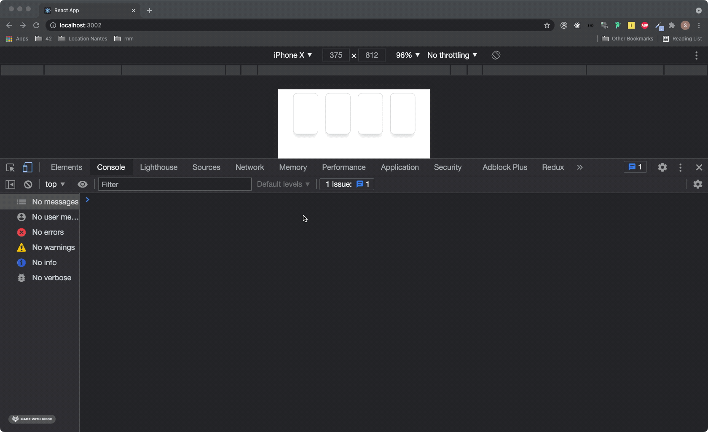
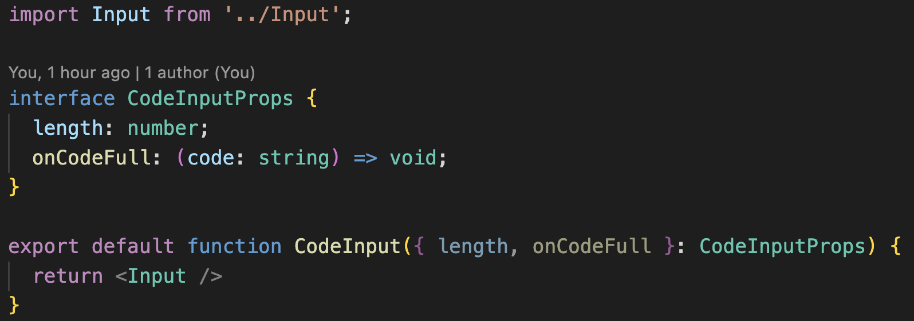

# React technical test

## Apperçu de l'attendu

## Exigences fonctionnelles

Le but de l'exercice est d'implementer un composant `CodeInput` permettant à l'utilisateur de rentrer un code reçu par sms.

- Le composant `CodeInput` est à implémenter dans le fichier `./src/technical-test/code-input/CodeInput.tsx`. **C'est le seul fichier qu'il est nécessaire de modifier**. Un squelette de code est déjà présent dans le fichier :

- Le composant `CodeInput` attend 2 props :
  - `length` : un nombre correspondant à la longueur du code à remplir
  - `onCodeFull` : une fonction à appeler lorsque le code est rempli
- Le composant `CodeInput` doit afficher une suite de composants `Input` (ex. Pour une `length` de 4, afficher 4 fois le composant `Input`). Le composant `Input` est défini dans `./src/technical-test/Input.tsx`. Il s'agit d'un simple wrapper autour d'un `<input />` html natif, il est donc possible de l'utiliser comme si il s'agissait d'un `<input />` natif. **Il n'est pas nécessaire de modifier le composant `Input`**.
- Le code reçu par sms ne peut être composé que de chiffres. Tout autre caractère doit être ignoré.
- L'utilisateur doit pouvoir remplir un chiffre par input affiché
- L'utilisateur doit pouvoir effacer le dernier chiffre rentré et revenir en arrière avec la touche `Backspace` de son clavier
- Lorsque le code est rempli, la fonction `onCodeFull` doit être appelée, avec le code converti en une suite de caractères (ex. Pour le code `1234`, il faudra appeler `onCodeFull("1234");`)
- Le focus doit automatiquement se placer sur le premier input non rempli en partant de la gauche, afin de permettre à l'utilisateur de rentrer tous les caractères sans avoir à gérer le focus manuellement. Le comportement à implémenter lorsque tous les inputs sont remplis n'est pas défini.

## Considérations techniques

- Pour lancer l'application : `npm run start`
- Pour lancer les tests : `npm run test`
- L'application a été créée avec [create-react-app](https://create-react-app.dev/) et les fichiers en dehors de `./src/technical-test` n'ont pas d'utilité particulière
- Le composant à implémenter est déjà appelé à partir du fichier `./src/App.tsx`. Il n'est pas nécessaire de modifier cet appel.
- Le seul fichier sur lequel une implémentation est attendue est `./src/technical-test/code-input/CodeInput.tsx`. Il est possible de créer d'autres fichiers si besoin, mais il est possible de réaliser l'exercice avec seulement ce composant.
- Des tests sur le composant créé sont encouragés
